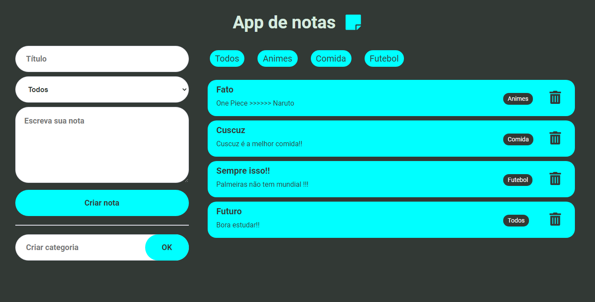

# App de Notas



> Um aplicativo de gerenciamento de notas simples, onde você pode criar notas com título, descrição e categoria; também é possível removê-las e filtrá-las por categoria. Construídos com a intenção de praticar os estudos React JS com componentes de classe.

## Pré-requisitos

- Ter o [NodeJS](https://nodejs.org/) instalado.

## Instalando

Para instalar, execute o seguinte comando na pasta do projeto:

```js
    npm install
```

## Rodando

Para rodar execute o seguinte comando na pasta do projeto:

```js
    npm start
```

O app poderá ser visto através do browser no link http://localhost:3000.
